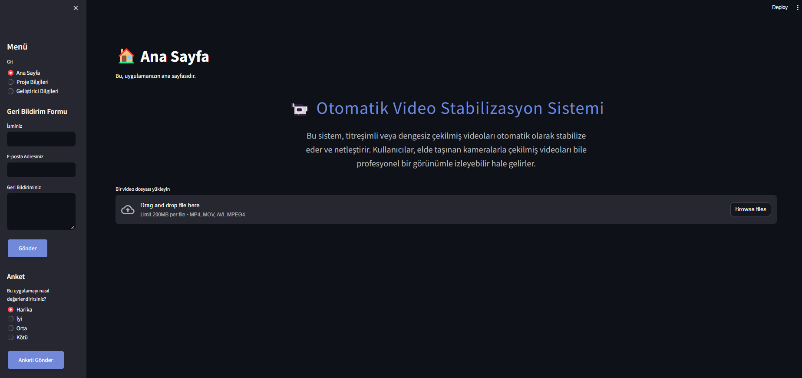
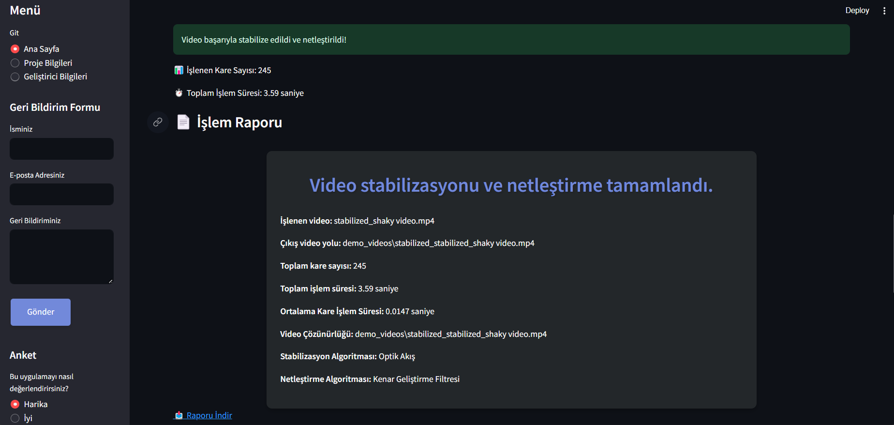

# 📹 Otomatik Video Stabilizasyon Sistemi

## Proje Açıklaması 📝

Otomatik Video Stabilizasyon Sistemi, elde taşınan kameralarla çekilmiş titreşimli veya dengesiz videoları otomatik olarak stabilize eden, aynı zamanda netleştirerek daha profesyonel bir görünüm kazandıran bir uygulamadır. Bu sistem sayesinde, videolarınızı hızlı ve kolay bir şekilde işleyebilir, sonuçları gerçek zamanlı olarak izleyebilir ve yüksek kaliteli içerikler elde edebilirsiniz.

## Özellikler ✨

- 🎥 **Video Stabilizasyonu:** Elde taşınan kameralarla çekilen videoların titreşimlerini otomatik olarak azaltır.
- 🔍 **Netleştirme:** Videoların kalitesini artırmak için kenar geliştirme ve netleştirme algoritmaları kullanılır.
- ⏱️ **Gerçek Zamanlı Önizleme:** İşlenmiş videoları anında izleyin ve düzenlemeleri gerçek zamanlı olarak görün.
- 📊 **Gelişmiş Performans İzleme:** CPU ve bellek kullanımı gibi detaylı işlem metriklerini takip edin, performansınızı optimize edin.
- 💾 **Veritabanı İşlemleri:** Kullanıcı profilleri, işlenen videolar ve işlem raporları veritabanında saklanır. Bu veriler, daha sonra analiz edilebilir ve yeniden kullanılabilir.
- 💬 **Geri Bildirim Formu:** Kullanıcılar, geri bildirimlerini uygulama içinde paylaşabilir.
- 📋 **Anket:** Kullanıcılar, uygulama deneyimlerini değerlendirebilecekleri bir anket doldurabilir.

## Kurulum 🛠️

Bu projeyi yerel makinenizde çalıştırmak için aşağıdaki adımları izleyin.

### Gereksinimler 📋

- Python 3.11
- OpenCV
- Streamlit
- Plotly
- SQLServer (veya başka bir SQL tabanlı veritabanı)

## Kurulum Adımları 🚀

Bu depoyu yerel makinenize klonlayın:

```bash
git clone https://github.com/ThecoderPinar/Otomatik-Video-Stabilizasyon.git
cd Otomatik-Video-Stabilizasyon
```

Gerekli Python paketlerini yükleyin:

```bash
pip install -r requirements.txt
```

Uygulamayı başlatın:

```bash
streamlit run main.py
```

## Kullanım Kılavuzu 📖

### Menü:
Ana menüde **Git** seçeneği ile **Ana Sayfa**, **Proje Bilgileri** veya **Geliştirici Bilgileri** sayfalarına gidebilirsiniz.

### Ana Sayfa:
- Bir video dosyası yükleyin.
- ✨ **Videoyu Stabilize Et ve Netleştir** butonuna tıklayın.

### Sonuçlar:
- İşlenmiş videonuzu izleyin.
- Videonuzu indirin ve arkadaşlarınızla paylaşın.
- İşlem raporunu görüntüleyin ve indirin.

### Ana Sayfa


### Video İşleme Sayfası


### Proje Bilgileri:
Bu sayfada proje hakkında daha detaylı bilgilere ulaşabilirsiniz.

### Geliştirici Bilgileri:
Projeyi geliştiren kişi hakkında bilgi sahibi olun ve iletişime geçin.

## Veritabanı İşlemleri 💾

Uygulama, işlenen videoları, kullanıcı profillerini ve işlem raporlarını bir veritabanında saklar. Bu veritabanı, SQLite tabanlı olup, ihtiyaca göre PostgreSQL, MySQL gibi diğer SQL tabanlı veritabanlarına da kolayca taşınabilir.

### Veritabanı İşlevleri

- **Kullanıcı Profilleri:** Kullanıcıların profilleri saklanır ve kullanıcıların video işleme geçmişi bu profillere kaydedilir.
- **İşlenen Videolar:** İşlenen videoların detayları (işlem süresi, kare sayısı vb.) veritabanında saklanır.
- **İşlem Raporları:** Her bir video işleme işlemi için oluşturulan raporlar, veritabanına kaydedilir ve daha sonra inceleme için geri çağrılabilir.


## Geri Bildirim Formu ve Anket 💬

### Geri Bildirim Formu
Uygulama içinde kullanıcılar geri bildirimde bulunabilir. Geri bildirim formu şu bilgileri içerir:

- **İsminiz**
- **E-posta Adresiniz**
- **Geri Bildiriminiz**

### Anket
Kullanıcılar, uygulama deneyimlerini değerlendirebilecekleri bir anket doldurabilir:

- **Bu uygulamayı nasıl değerlendirirsiniz?**
  - Harika
  - İyi
  - Orta
  - Kötü

## Gelecek Özellikler 🚀

Gelecekte eklenmesi planlanan bazı özellikler şunlardır:

- 🔧 **Video Düzenleme Araçları:** Kullanıcıların videolarını kesmelerine, birleştirmelerine ve çeşitli efektler eklemelerine olanak tanıyan gelişmiş video düzenleme araçları.
- 🌐 **Web Entegrasyonları:** Uygulamanın bir web servisi olarak kullanılabilmesi için API entegrasyonları.
- 📈 **Gelişmiş Analizler:** Kullanıcıların işlenen videoları üzerinde daha derinlemesine analizler yapabilmeleri için gelişmiş analiz araçları.
- 🎨 **Tema Desteği:** Kullanıcıların arayüzü kendi zevklerine göre özelleştirmelerini sağlayan tema seçenekleri.
- 👥 **Kullanıcı Rolleri:** Farklı kullanıcı rolleri (yönetici, kullanıcı vb.) ve bu rollere göre yetkilendirme sistemleri.

## Geliştirici Bilgileri 👩‍💻

- **Ad:** Pinar Topuz
- **E-posta:** [piinartp@gmail.com](mailto:piinartp@gmail.com)
- **GitHub:** [github.com/ThecoderPinar](https://github.com/ThecoderPinar)

## Katkıda Bulunma 🤝

Bu projeye katkıda bulunmak mı istiyorsunuz? Harika! Yeni fikirler, geliştirmeler ve hata düzeltmeleri için her türlü katkıya açığız. Katkıda bulunmak için:

1. Bir issue açarak önerilerinizi paylaşın.
2. Yeni özellikler veya düzeltmeler için bir pull request gönderin.

Tüm katkılar, proje topluluğu tarafından memnuniyetle karşılanır.

## Lisans 📄

Bu proje MIT lisansı ile lisanslanmıştır. Detaylı bilgi için [LICENSE](./LICENSE) dosyasına göz atabilirsiniz.
